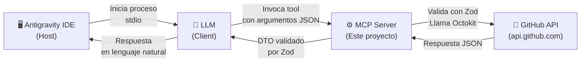

# 🐙 GitHub MCP Server

Un servidor [Model Context Protocol (MCP)](https://modelcontextprotocol.io/) que permite a modelos de lenguaje (LLMs) interactuar directamente con la API de GitHub. Construido con TypeScript, Octokit y Zod.

## 📋 Descripción del Proyecto

Este servidor MCP actúa como puente entre un LLM y la API de GitHub, exponiendo **8 herramientas** que permiten al modelo gestionar repositorios, issues y commits sin intervención humana directa. Cada herramienta valida sus entradas y salidas con esquemas Zod, garantizando contratos estrictos entre el modelo y la API.

### Herramientas disponibles

| Herramienta | Descripción |
|---|---|
| `list-repo` | Lista los repositorios del usuario autenticado |
| `create-repo` | Crea un nuevo repositorio |
| `list-issues` | Lista las issues abiertas de un repositorio |
| `create-issue` | Crea una nueva issue |
| `close-issue` | Cierra una issue existente |
| `add-comment-to-issue` | Agrega un comentario a una issue |
| `create-commit` | Crea un commit con uno o más archivos (sin clonar el repo) |
| `list-commits` | Lista los commits recientes de un repositorio |

---

## 🏗️ Arquitectura

El servidor sigue el protocolo MCP estándar, comunicándose via `stdio` con el host:



### Flujo interno de cada herramienta

```
Argumentos del LLM
       │
       ▼
┌──────────────┐
│  Zod Input   │ ← Valida parámetros de entrada
│  Schema      │
└──────┬───────┘
       │
       ▼
┌──────────────┐
│   Handler    │ ← Lógica de negocio + llamada a Octokit
└──────┬───────┘
       │
       ▼
┌──────────────┐
│  Zod Output  │ ← Valida y transforma la respuesta de GitHub
│  Schema      │
└──────┬───────┘
       │
       ▼
┌──────────────┐
│  mapGitHub   │ ← Manejo centralizado de errores
│  Error()     │   (401, 403, 404, 422, red)
└──────┬───────┘
       │
       ▼
  JSON al LLM
```

---

## 📦 Requisitos Previos

- **Node.js** v18 o superior
- **npm** (incluido con Node.js)
- **Git** (para clonar el repositorio)
- Una cuenta de **GitHub** con un Personal Access Token

---

## 🔑 Obtener un GitHub Personal Access Token

El servidor necesita un token de acceso personal para autenticarse con la API de GitHub.

### Paso a paso

1. Inicia sesión en [github.com](https://github.com)
2. Ve a **Settings** → **Developer settings** → **Personal access tokens** → **Tokens (classic)**
   - URL directa: [https://github.com/settings/tokens](https://github.com/settings/tokens)
3. Haz clic en **"Generate new token"** → **"Generate new token (classic)"**
4. Configura el token:
   - **Note:** `MCP Server` (o cualquier nombre descriptivo)
   - **Expiration:** Elige la duración que prefieras
   - **Scopes:** `repo` (acceso completo a repositorios privados y públicos)
5. Haz clic en **"Generate token"**
6. **Copia el token inmediatamente** — no podrás verlo de nuevo

> ⚠️ **Importante:** Nunca compartas tu token ni lo subas a un repositorio público. El archivo `.env` ya está incluido en `.gitignore` para protegerlo.

---

## 🚀 Instalación Paso a Paso

### 1. Clonar el repositorio

```bash
git clone https://github.com/SolInvictus7x7/ProyectoM5_DanielInostroza.git
cd ProyectoM5_DanielInostroza
```

### 2. Instalar dependencias

```bash
npm install
```

### 3. Configurar el token de GitHub

Crea un archivo `.env` en la raíz del proyecto con tu token:

```bash
# Copiar el archivo de ejemplo
cp .env.example .env
```

Luego edita `.env` y reemplaza el valor:

```env
GITHUB_TOKEN=ghp_tu_token_aqui
```

### 4. Compilar el proyecto

```bash
npm run build
```

### 5. Verificar la instalación

Ejecuta el inspector MCP para probar que todo funciona:

```bash
npm run inspect
```

Esto abre el [MCP Inspector](https://github.com/modelcontextprotocol/inspector) en tu navegador, donde puedes probar cada herramienta de forma interactiva.

---

## ⚙️ Configuración con Antigravity IDE

Para usar este servidor MCP con Antigravity, agrega la siguiente entrada en tu archivo de configuración MCP (`mcp_config.json`):

```json
{
  "github-mcp-server": {
    "command": "npx",
    "args": [
      "tsx",
      "/ruta/a/ProyectoM5_DanielInostroza/src/index.ts"
    ]
  }
}
```

Esto ejecuta el servidor directamente desde el código fuente con `tsx`, sin necesidad de compilar primero. El token de GitHub se lee automáticamente desde el archivo `.env` del proyecto.

---

## 🛠️ Documentación de Herramientas

Cada herramienta incluye ejemplos de prompts efectivos que puedes usar con el LLM.

---

### `list-repo` — Listar repositorios

Lista los repositorios del usuario autenticado, ordenados por última actualización.

**Parámetros:** Ninguno

**Respuesta:** Array de objetos con `name`, `description`, `html_url`, `stargazers_count`, `fork`, `private`, `language`, `updated_at`.

**Ejemplos de prompts:**

```
"Muéstrame todos mis repositorios de GitHub"

"¿Cuáles son mis repos más recientes?"

"Lista mis repositorios privados"
```

**Ejemplo de respuesta:**

```json
[
  {
    "name": "mi-proyecto",
    "description": "Un proyecto de ejemplo",
    "html_url": "https://github.com/usuario/mi-proyecto",
    "stargazers_count": 12,
    "fork": false,
    "private": false,
    "language": "TypeScript",
    "updated_at": "2026-06-20T15:30:00Z"
  }
]
```

---

### `create-repo` — Crear repositorio

Crea un nuevo repositorio para el usuario autenticado.

**Parámetros:**

| Parámetro | Tipo | Requerido | Descripción |
|---|---|---|---|
| `repo_name` | string | ✅ | Nombre del repositorio (3-100 caracteres, alfanumérico y guiones) |
| `description` | string | ✅ | Descripción corta del repositorio |
| `add_readme` | boolean | ❌ | Inicializar con README.md (default: `false`) |
| `private` | boolean | ❌ | Si el repositorio es privado (default: `false`) |
| `gitignore_template` | string | ❌ | Template de .gitignore (ej: `"Node"`, `"Python"`) |

**Ejemplos de prompts:**

```
"Crea un repositorio llamado 'mi-api' con descripción 'API REST de ejemplo' y un README inicial"

"Crea un repo privado llamado 'notas-personales' con gitignore de Node"

"Necesito un nuevo repositorio público para mi proyecto de Python, llámalo 'data-pipeline'"
```

---

### `list-issues` — Listar issues

Lista las issues abiertas de un repositorio. Soporta dos modos: compacto y detallado.

**Parámetros:**

| Parámetro | Tipo | Requerido | Descripción |
|---|---|---|---|
| `owner` | string | ✅ | Dueño del repositorio |
| `repo` | string | ✅ | Nombre del repositorio |
| `include_details` | boolean | ❌ | Incluir body, milestone, timestamps (default: `false`) |

> 💡 **Nota:** Esta herramienta filtra automáticamente los Pull Requests, devolviendo solamente issues reales.

**Ejemplos de prompts:**

```
"Lista las issues abiertas del repositorio 'mi-api' de 'usuario'"

"Muéstrame las issues con detalles completos del repo 'ProyectoM5_DanielInostroza' del owner 'SolInvictus7x7'"

"¿Hay issues abiertas en mi repo 'data-pipeline'?"
```

---

### `create-issue` — Crear issue

Crea una nueva issue en un repositorio.

**Parámetros:**

| Parámetro | Tipo | Requerido | Descripción |
|---|---|---|---|
| `owner` | string | ✅ | Dueño del repositorio |
| `repo` | string | ✅ | Nombre del repositorio |
| `title` | string | ✅ | Título de la issue |
| `body` | string | ❌ | Cuerpo/descripción en markdown |
| `labels` | string[] | ❌ | Array de etiquetas |
| `assignees` | string[] | ❌ | Array de usernames a asignar |

**Ejemplos de prompts:**

```
"Crea una issue en 'mi-api' con título 'Bug: login falla con caracteres especiales' y etiqueta 'bug'"

"Abre una issue en el repo 'data-pipeline' del owner 'usuario' con título 'Agregar soporte para CSV' y asígnala a 'usuario'"

"Crea una issue de feature request en mi repo 'mi-api' describiendo que necesitamos autenticación OAuth"
```

---

### `close-issue` — Cerrar issue

Cierra una issue existente cambiando su estado a `closed`.

**Parámetros:**

| Parámetro | Tipo | Requerido | Descripción |
|---|---|---|---|
| `owner` | string | ✅ | Dueño del repositorio |
| `repo` | string | ✅ | Nombre del repositorio |
| `issue_number` | number | ✅ | Número de la issue a cerrar |

**Ejemplos de prompts:**

```
"Cierra la issue #5 del repo 'mi-api' de 'usuario'"

"La issue número 12 de 'data-pipeline' ya está resuelta, ciérrala"

"Cierra todas las issues que mencionan 'duplicado' en 'mi-api'"
```

---

### `add-comment-to-issue` — Comentar en una issue

Agrega un comentario a una issue existente.

**Parámetros:**

| Parámetro | Tipo | Requerido | Descripción |
|---|---|---|---|
| `owner` | string | ✅ | Dueño del repositorio |
| `repo` | string | ✅ | Nombre del repositorio |
| `issue_number` | number | ✅ | Número de la issue |
| `body` | string | ✅ | Contenido del comentario en markdown |

**Ejemplos de prompts:**

```
"Agrega un comentario en la issue #3 de 'mi-api' diciendo 'Esto se solucionó en el commit abc123'"

"Comenta en la issue #7 del repo 'data-pipeline' de 'usuario' explicando los pasos para reproducir el bug"

"Deja una nota en la issue #1 de 'mi-api' mencionando que se necesita más información"
```

---

### `create-commit` — Crear commit

Crea un commit con uno o más archivos usando la Git Data API, **sin necesidad de clonar el repositorio**.

**Parámetros:**

| Parámetro | Tipo | Requerido | Descripción |
|---|---|---|---|
| `owner` | string | ✅ | Dueño del repositorio |
| `repo` | string | ✅ | Nombre del repositorio |
| `message` | string | ✅ | Mensaje del commit |
| `branch` | string | ❌ | Branch destino (default: `"main"`) |
| `files` | array | ✅ | Array de archivos: `{ path, content }` |

**Ejemplos de prompts:**

```
"Haz un commit en 'mi-api' en la branch 'main' con el archivo 'src/index.ts' que contenga un servidor Express básico"

"Commitea un archivo README.md en el repo 'data-pipeline' con la documentación del proyecto"

"Crea un commit en 'mi-api' branch 'develop' con dos archivos: 'src/utils.ts' y 'src/types.ts'"
```

> ⚠️ **Nota:** Esta herramienta ejecuta internamente 6 llamadas a la API de GitHub (getRef → getCommit → createBlob → createTree → createCommit → updateRef) para crear el commit sin clonar el repositorio.

---

### `list-commits` — Listar commits

Lista los commits recientes de un repositorio.

**Parámetros:**

| Parámetro | Tipo | Requerido | Descripción |
|---|---|---|---|
| `owner` | string | ✅ | Dueño del repositorio |
| `repo` | string | ✅ | Nombre del repositorio |
| `per_page` | number | ❌ | Cantidad de commits a devolver, 1-100 (default: `30`) |

**Ejemplos de prompts:**

```
"Muéstrame los últimos 10 commits del repo 'mi-api' de 'usuario'"

"¿Cuáles son los commits más recientes en 'data-pipeline'?"

"Lista los últimos 5 commits del repositorio 'ProyectoM5_DanielInostroza' del owner 'SolInvictus7x7'"
```

---

## 🧪 Testing

El proyecto incluye una suite de tests con Vitest que cubre esquemas de validación, handlers de herramientas y el mapeo de errores.

### Ejecutar todos los tests

```bash
npm test
```

### Ejecutar tests en modo watch

```bash
npm run test:watch
```

### Estructura de tests

```
tests/
├── github/
│   └── errorMap.test.ts      # Tests del mapper centralizado de errores
├── schemas/
│   ├── repo.test.ts           # Contratos de esquemas de repositorios
│   ├── issue.test.ts          # Contratos de esquemas de issues
│   └── commit.test.ts         # Contratos de esquemas de commits
├── tools/
│   ├── repo_tools.test.ts     # Tests de handlers: list-repo, create-repo
│   ├── issue_tools.test.ts    # Tests de handlers: issues + filtro de PRs
│   └── commit_tools.test.ts   # Tests de handlers: create-commit, list-commits
└── utils/
    ├── schemaTester.ts        # Helper reutilizable para tests de esquemas
    └── toolTester.ts          # Helper reutilizable para tests de handlers
```

---

## 📁 Estructura del Proyecto

```
ProyectoM5_DanielInostroza/
├── src/
│   ├── index.ts                  # Punto de entrada — registra tools en el McpServer
│   ├── github/
│   │   ├── github_client.ts      # Instancia de Octokit con retry y auth
│   │   └── errorMap.ts           # Mapper centralizado de errores de GitHub
│   ├── schemas/
│   │   └── index.ts              # Todos los esquemas Zod (input y output)
│   ├── tools/
│   │   ├── list_repo.ts          # Handler: listar repositorios
│   │   ├── create_repo.ts        # Handler: crear repositorio
│   │   ├── list_issues.ts        # Handler: listar issues
│   │   ├── create_issue.ts       # Handler: crear issue
│   │   ├── close_issue.ts        # Handler: cerrar issue
│   │   ├── add_comment_to_issue.ts # Handler: comentar en issue
│   │   ├── create_commit.ts      # Handler: crear commit (Git Data API)
│   │   └── list_commits.ts       # Handler: listar commits
│   └── utils/
│       └── logger.ts             # Logger que escribe a stderr
├── tests/                        # Suite de tests (Vitest)
├── dist/                         # Código compilado (generado por tsc)
├── package.json
├── tsconfig.json
├── .env.example                  # Template de variables de entorno
└── .gitignore
```

---

## 🔧 Stack Tecnológico

| Tecnología | Versión | Propósito |
|---|---|---|
| [TypeScript](https://www.typescriptlang.org/) | ^6.0 | Lenguaje principal con tipado estricto |
| [MCP SDK](https://github.com/modelcontextprotocol/typescript-sdk) | 1.29.0 | Framework del protocolo MCP |
| [Octokit](https://github.com/octokit/rest.js) | 22.0.1 | Cliente oficial de la API de GitHub |
| [Zod](https://zod.dev/) | 4.4.3 | Validación de esquemas de entrada y salida |
| [Vitest](https://vitest.dev/) | ^4.1 | Framework de testing |
| [dotenv](https://github.com/motdotla/dotenv) | ^17.4 | Carga de variables de entorno |

---

## 📝 Scripts Disponibles

| Comando | Descripción |
|---|---|
| `npm run build` | Compila TypeScript a JavaScript en `dist/` |
| `npm run dev` | Compilación en modo watch (desarrollo) |
| `npm start` | Ejecuta el servidor MCP compilado |
| `npm run inspect` | Abre el MCP Inspector para testing interactivo |
| `npm test` | Ejecuta todos los tests con Vitest |
| `npm run test:watch` | Tests en modo watch |

---